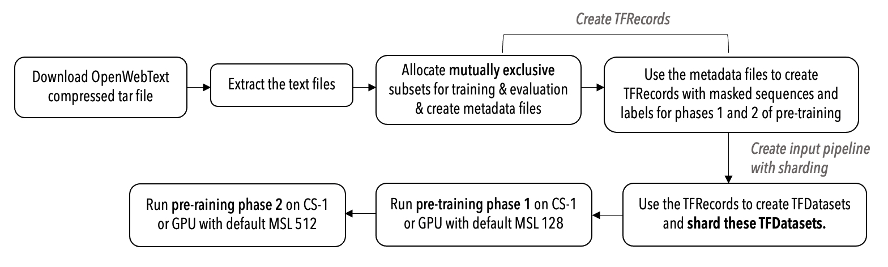

# Running BERT: Example Steps

- [Running BERT: Example Steps](#running-bert-example-steps)
	- [Structure of the code](#structure-of-the-code)
	- [Before you start](#before-you-start)
- [Download and prepare the dataset](#download-and-prepare-the-dataset)
	- [Download](#download)
		- [OpenWebText dataset](#openwebtext-dataset)
	- [Extract](#extract)
	- [Allocate subsets for training and validation](#allocate-subsets-for-training-and-validation)
	- [Create TFRecords](#create-tfrecords)
		- [Create TFRecords for 2-phase pre-training](#create-tfrecords-for-2-phase-pre-training)
			- [Phase 1: MSL 128](#phase-1-msl-128)
			- [Phase 2: MSL 512](#phase-2-msl-512)
	- [BERT input function](#bert-input-function)
		- [BERT features dictionary](#bert-features-dictionary)
		- [BERT label tensor](#bert-label-tensor)
	- [Input pipeline with sharding](#input-pipeline-with-sharding)
- [Run Pre-training](#run-pre-training)
	- [Run pre-training on the Cerebras System](#run-pre-training-on-the-cerebras-system)
	- [Run pre-training on GPU](#run-pre-training-on-gpu)
		- [Distributed data-parallel training](#distributed-data-parallel-training)
	- [MLM Loss Scaling](#mlm-loss-scaling)
    - [Variable Sequence Length](#variable-sequence-length)
	- [Appendix](#appendix)
		- [PubMed Dataset](#pubmed-dataset)


This document walks you through an example showing the steps to run a BERT pre-training on the Cerebras Wafer Scale Engine (and on GPUs) using the code in this repo.

> **Note**: You can use any subset of the steps described in this example. For example, if you already downloaded your preferred dataset and created the TFRecords, then you can skip the section [Create TFRecords](#create-tfrecords).

**Reference**: BERT paper on arXiv.org: [BERT: Pre-training of Deep Bidirectional Transformers for Language Understanding](https://arxiv.org/abs/1810.04805).

The following block diagram shows a high-level view of the sequence of steps you will perform in this example.



## Structure of the code

* `configs/`: YAML configuration files.
* `fine_tuning`: Code for fine tuning the BERT model.
* `input/`: Input pipeline implementation based on the Open Web Text dataset. This directory also contains the scripts you can use to download and prepare the Open Web Text dataset. Vocab files are located in `transformers/vocab/`.
* `input/pubmed_scripts/`: Location where PubMed dataset TFRecords will be stored. Vocab files are located in `transformers/vocab/`.
* `layers/`: Implementations of BERT-specific layers.
* `BertModel.py`: Model implementation. A bulk of the model is defined in this script. It inherits from the central BaseModel located in `common/tf/TFBaseModel.py`. The model also uses Cerebras-defined layers that are located in `common/tf/layers`.
* `data.py`: The entry point to the data input pipeline code. Defines `input_fn`.
* `model.py`: The entry point to the model. Defines `model_fn`.
* `run.py`: Training script. Performs training and validation.
* `utils.py`: Miscellaneous scripts, including `get_params` to parse the `params` dictionary from the YAML files.

## Before you start

This example walk-through consists of two main steps:

1. Prepare the dataset
2. Perform the pre-training

This example follows the standard practice of two-phase pre-training for BERT models. In the two-phase pre-training, the model is:

- First pre-trained with the maximum sequence length (MSL) of 128 for 90% of the steps.
- Then the final 10% of the steps are pre-trained with the MSL of 512.

**TFRecords for each phase**: You will need to create different TFRecords for each of these two phases of pre-training.

# Download and prepare the dataset

## Download

### OpenWebText dataset

The scripts for downloading and preprocessing OpenWebText dataset: [https://skylion007.github.io/OpenWebTextCorpus/](https://skylion007.github.io/OpenWebTextCorpus/) are located [here](../data_processing/scripts/owt/).

> **Note**: The OpenWebText is just one example of the datasets that can be used for BERT training. See [Appendix](#appendix) for other datasets.

The preprocessing comprises of creating TFRecords containing masked sequences and labels.

Start by downloading the OWT dataset by accessing the following link from a browser:

```url
https://drive.google.com/uc?id=1EA5V0oetDCOke7afsktL_JDQ-ETtNOvx
```

and manually download the `tar.xz` file from that location to your preferred local directory.

> **NOTE**: Currently a server side issue with the OWT site prevents using the below `extract.sh` shell script to download this tar file. We will update the script when this issue resolved.

## Extract

To extract the above-downloaded files, run:

```bash
bash extract.sh
```

> **NOTE**: The `extract.sh` may take a while to complete, as it unpacks 40GB of data (8,013,770 documents).

Upon completion, the script will produce `openwebtext` folder in the same folder where the tar file is located. The `openwebtext` folder will have multiple subfolders, each containing a collection of `*.txt` files of raw text data (one document per `.txt` file).

## Allocate subsets for training and validation

In the next step, you will create two subsets of extracted txt files, one for training and the second for validation. These two subsets are then used to create TFRecords that will be used for pre-training.

> **IMPORTANT**: The training and validation subsets must contain mutually exclusive txt files.

Proceed as follows:

Define metadata files that contain paths to subsets of documents in the `openwebtext` folder to be used for training or validation.

For training, in this tutorial we use a subset of 512,000 documents. The associated metadata file can be found in `metadata/train_512k.txt`.

For validation, we choose 5,000 documents that are not in the training set. The metadata file for validation can be found in `metadata/val_files.txt`.

>**NOTE**: You are free to create your own metadata files that define your train and validation data subsets, with your preferred content and sizes. You can also create a data subset for test.

Next, using the metadata file that defines a data subset (for training or for validation), create TFRecords containing masked sequences and labels derived from the data subset. See the following diagram:


## Create TFRecords

**create_tfrecords.py**

To create TFRecords containing masked sequences and labels derived from the data subset, you will use the Python utility `create_tfrecords.py` located in the [input/scripts](input/scripts) directory.

**create_tfrecords_mlm_only.py**

In addition, `create_tfrecords_mlm_only.py` should be used to create data without the NSP labels. Note that,

- `create_tfrecords.py` makes TFRecords to be used with `BertTfRecordsProcessor`.
- `create_tfrecords_mlm_only.py` makes TFRecords to be used with `BertMlmOnlyTfRecordsDynamicMaskProcessor.py` or `BertMlmOnlyTfRecordsStaticMaskProcessor.py`.

Refer to [./input/scripts/README.md](./input/scripts/README.md) for more details.

**Prerequisites**

If you do not have [spaCy](https://spacy.io/), the natural language processing (NLP) library, then install it with the following commands:

```bash
pip install spacy
python -m spacy download en
```

**Syntax**

The command-line syntax to run the Python utility `create_tfrecords.py` is as follows:

```bash
python create_tfrecords.py --metadata_files /path/to/metadata_file.txt --input_files_prefix /path/to/raw/data/openwebtext --vocab_file /path/to/vocab.txt --do_lower_case
```

where:

- `metadata_file.txt` is a metadata file containing a list of paths to documents, and
- `/path/to/vocab.txt` contains a vocabulary file to map WordPieces to word IDs.

For example, you can use the supplied `metadata/train_512k.txt` as an input to generate a training set based on 512,000 documents. In this tutorial we used the duplication factor of 10. The resulting dataset then ensures that after 900K steps with batch size 256 each sequence is seen ~40 times, with exactly the same mask for ~4 times. Sample vocabularies can be found in the `bert/vocab` folder.

For more details, run the command: `python create_tfrecords.py --help` (or `python create_tfrecords_mlm_only.py --help` if creating MLM-only data).

### Create TFRecords for 2-phase pre-training

For the 2-phase BERT pre-training that we are following in this tutorial, you need to generate the following datasets:

- A training dataset for the first phase using sequences with maximum length of 128.
- A second training dataset for the second phase using sequences with maximum sequence length of 512.

If you want to run validation, then:
- Two additional validation datasets, one each for each phase.

In total, to run training and validation for both the pre-training phases, you will need four datasets: a training and a validation dataset for phase 1 with MSL 128, and a training and a validation dataset for phase 2 with MSL 512.

Proceed as follows to run the following commands:

#### Phase 1: MSL 128

**Generate training TFRecords**:

```bash
python create_tfrecords.py --metadata_files metadata/train_512k.txt --input_files_prefix /path/to/raw/data/openwebtext --vocab_file ../../../vocab/google_research_uncased_L-12_H-768_A-12.txt --output_dir train_512k_uncased_msl128 --do_lower_case --max_seq_length 128 --max_predictions_per_seq 20
```

**Generate validation TFRecords**:

```bash
python create_tfrecords.py --metadata_files metadata/val_files.txt --input_files_prefix /path/to/raw/data/openwebtext --vocab_file ../../../vocab/google_research_uncased_L-12_H-768_A-12.txt --output_dir val_uncased_msl128 --do_lower_case --max_seq_length 128 --max_predictions_per_seq 20
```

#### Phase 2: MSL 512

**Generate training TFRecords**:

```bash
python create_tfrecords.py --metadata_files metadata/train_512k.txt --input_files_prefix /path/to/raw/data/openwebtext --vocab_file ../../../vocab/google_research_uncased_L-12_H-768_A-12.txt --output_dir train_512k_uncased_msl512 --do_lower_case --max_seq_length 512 --max_predictions_per_seq 80
```

**Generate validation TFRecords**:

```bash
python create_tfrecords.py --metadata_files metadata/val_files.txt --input_files_prefix /path/to/raw/data/openwebtext --vocab_file ../../../vocab/google_research_uncased_L-12_H-768_A-12.txt --output_dir val_uncased_msl512 --do_lower_case --max_seq_length 512 --max_predictions_per_seq 80
```

The above-created TFRecords are then used by the `BertTfRecordsProcessor` class to produce inputs to `BertModel`.

## BERT input function

If you want to use your own dataset with this example code, then this section describes the input data format expected by this example code.

When you create your own custom BERT input function, you must ensure that your BERT input function produces a features dictionary and a label tensor as described in this section.

#### BERT features dictionary

The features dictionary has the following key/values:

- `input_ids`: Input token IDs, padded with 0s to `max_sequence_length`.
  - Shape: [`batch_size`, `max_sequence_length`].
  - Type: int64

- `input_mask`: Mask for padded positions. Has values 1 on the padded positions and 0 elsewhere.
  - Shape: [`batch_size`, `max_sequence_length`]
  - Type: int32

- `segment_ids`: Segment IDs. Has values 0 on the positions corresponding to the first segment, and 1 on positions corresponding to the second segment. Padded with 2 when using [VSL mode](#variable-sequence-length) and 0 otherwise.
  - Shape: [`batch_size`, `max_sequence_length`]
  - Type: int32

- `masked_lm_ids`: IDs of masked tokens, padded with 0s to `max_predictions_per_seq` to accommodate a variable number of masked tokens per sample.
  - Shape: [`batch_size`, `max_predictions_per_seq`]
  - Type: int32

- `masked_lm_positions`: Positions of masked tokens in the `input_ids` tensor, padded with 0s to `max_predictions_per_seq`.
  - Shape: [`batch_size`, `max_predictions_per_seq`]
  - Type: int32

- `masked_lm_weights`: Mask for `masked_lm_ids` and `masked_lm_positions`. Has values `batch_size` / `num_masked_tokens_in_batch` on the positions corresponding to actually masked tokens in the given sample, and 0.0 elsewhere. See the [MLM Loss Scaling](#mlm-loss-scaling) section for more detail.
  - Dimensions: [`batch_size`, `max_predictions_per_seq`]
  - Type: float32

#### BERT label tensor

The label tensor of shape (`batch_size`,). Carries the next sentence labels.

## Input pipeline with sharding

In addition, the above-created TFRecords are used by the `BertTfRecordsProcessor` class to create a sharded dataset, using the `shard_dataset.py` utility. For a detailed explanation of sharding, see <a href="https://docs.cerebras.net/en/latest/tensorflow-docs/preparing-tf-input/sharding-for-cs.html" class="external-link">Sharding For the Cerebras System</a>.

# Run Pre-training

**IMPORTANT**: See the following notes before proceeding further.

**Parameter settings in YAML config file**: The config YAML files are located in [configs](configs/) directory. Before starting a pre-training run, make sure that in the YAML config file you are using:

   - The `train_input.data_dir` parameter points to the correct dataset, and
   - The `train_input.max_sequence_length` parameter corresponds to the sequence length of the dataset.

**Phase-1 with MSL128 and phase-2 with MSL512**: To continue the pre-training with MSL=512 from a checkpoint that resulted from the first phase of MSL=128, the parameter `model.max_position_embeddings` should be set to 512 for both the phases of pre-training.

**Phase-1 with MSL128**: If you would like to pre-train a model with MSL=128 and do not plan to use that model to continue pre-training with a longer sequence length, then you can change this `model.max_position_embeddings` parameter to 128.

## Run pre-training on the Cerebras System

To run pre-training on the Cerebras System, the training job should be launched inside of the Cerebras environment. In addition, the `cs_ip` should be provided either as a command line argument `--cs_ip` or in the YAML config file.

**Syntax**

Execute the following from within the Cerebras environment:

```
csrun_wse python run.py --mode train --cs_ip x.x.x.x --params configs/params_bert_<model>.yaml --model_dir /path/to/model_dir
```

where:

- `/path/to/yaml` is a path to the YAML config file with model parameters. A few example YAML config files can be found in the [configs](configs) directory.
- `/path/to/model_dir` is a path to the directory where you would like to store the logs and other artifacts of the run.

When training on the Cerebras System, the `--multireplica` flag can be used to do data-parallel training across multiple copies of the model at the same time.

> **Note**: For training on the Cerebras System with an orchestrator like Slurm, also see [Train on the Cerebras System](https://docs.cerebras.net/en/latest/tensorflow-docs/running-a-model/train-eval-predict.html).

## Run pre-training on GPU

**Syntax**

To run pre-training on GPU, use the `run.py` Python utility as follows:
```
python run.py --mode train --params /path/to/yaml --model_dir /path/to/model_dir
```

### Distributed data-parallel training

When training is executed in a multi-GPU setup, the batch size specified in the YAML file is treated as per-device batch size. To obtain the effective batch size you should multiply the batch size value in the YAML file by the number of GPUs. When you switch between the training on the GPUs and on the Cerebras System, it is important to take this into account to ensure that you use a proper batch size.

**Example**

**MSL 128**

For example, to start the pre-training of BERT Base model with default settings, and with the maximum sequence length of 128, run the following command:

```
python run.py --mode train --params configs/params_bert_base_msl128.yaml --model_dir model_dir_bert_base
```

When the run is finished, you will find the training artifacts, including model checkpoints, in the directory `model_dir_bert_base`.

**MSL 512**

After the MSL128 portion of pretraining is complete, the MSL512 restart can be performed by training on the same `model_dir` using the MSL512 config file, as follows:

```
python run.py --mode train --params configs/params_bert_base_msl512.yaml --model_dir model_dir_bert_base
```

## MLM Loss Scaling

The MLM Loss is scaled by the number of masked tokens in the current batch. For numerical reasons this scaling is done in two steps:
- First, the `masked_lm_weights` tensor is scaled by `batch_size` / `num_masked_tokens_in_batch` in the input pipeline, and then
- The final loss is scaled by 1 / `batch_size`.

## Variable Sequence Length
By default, pretraining is configured to use Variable Sequence Length (VSL) mode when running on the Cerebras System. When running in the VSL mode, the Cerebras System does not perform any computation on padding tokens. This can potentially result in training speedups. The VSL mode can be disabled by setting `model.use_vsl: False` in the appropriate config file. Regardless of the setting of this flag, VSL is not used for running in eval mode.

In order to take full advantage of the potential speedups from VSL, it is helpful to batch samples such that every sample in a given batch has a similar length. Accordingly, for BERT pretraining we bucket samples of similar lengths together before batching. The boundaries between different buckets are defined by `train_input.buckets`. With VSL and bucketing enabled, we are able to get 1.6x throughput for the MSL 512 stage of pretraining compared to running without VSL or bucketing.

## Appendix

### PubMed Dataset

- The scripts to download and preprocess the PubMed dataset are located here: [PubMed Dataset](../data_processing/scripts/pubmed/).
- The YAML config files to train BERT Base and BERT Large with PubMed data are in the  [configs](configs) directory.
